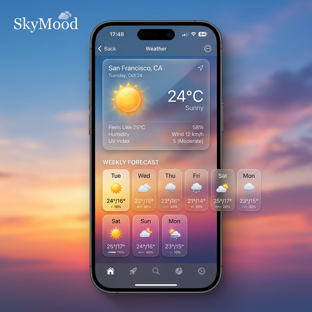

# 🌤️ SkyMood - Advanced Weather Companion

SkyMood is a premium, feature-rich weather forecast application built with modern Android development practices. It provides real-time weather data, accurate 5-day forecasts, and highly customizable weather alerts to keep you informed and prepared.

## ✨ Key Features

- **Real-time Forecast**: Instant weather updates for your current GPS location or any custom location selected via map.
- **5-Day / 3-Hour Forecast**: Detailed weather breakdowns including temperature, humidity, wind speed, and atmospheric conditions.
- **Smart Weather Alerts**: Set persistent alerts for specific time windows. Choose between subtle notifications or full alarm sounds.
- **Customizable Experience**:
    - **Units**: Toggle between Celsius, Fahrenheit, and Kelvin.
    - **Language**: Full support for English and Arabic (including RTL layout).
    - **Location Method**: Seamless switching between GPS-based tracking and manual Map selection.
- **Favorites Management**: Save your most-visited cities for quick weather access.
- **Premium Aesthetics**: A stunning UI designed with glassmorphism, smooth animations, and dynamic backgrounds that change based on weather conditions.

## 🏗️ Architecture

SkyMood follows a **Strict MVVM (Model-View-ViewModel)** architectural pattern. 

### Manual Dependency Injection
To maintain total control and testability, we implemented a **Manual Dependency Injection (Service Locator)** pattern via the `SkyMood` application class. 
- **Repositories** (`WeatherRepository`, `LocationRepository`, `SettingsRepository`, `AlertsRepository`) act as a buffer between the UI and data sources.
- **ViewModels** only interact with Repositories.
- **DataSources** (Room, DataStore, OpenWeather API) are encapsulated and hidden from the UI layer.

## 🛠️ Tech Stack

- **UI**: [Jetpack Compose](https://developer.android.com/compose) - Modern declarative UI toolkit.
- **Local Database**: [Room](https://developer.android.com/training/data-storage/room) - Robust local persistence for cached weather and alerts.
- **Preferences**: [DataStore](https://developer.android.com/topic/libraries/architecture/datastore) - Reactive replacement for SharedPreferences.
- **Network**: [Retrofit](https://square.github.io/retrofit/) - Type-safe HTTP client for OpenWeather API.
- **Background Tasks**: [WorkManager](https://developer.android.com/topic/libraries/architecture/workmanager) & `AlarmManager` for reliable weather alerts.
- **Asynchrony**: [Kotlin Coroutines](https://kotlinlang.org/docs/coroutines-overview.html) & [Flow](https://kotlinlang.org/docs/flow.html) for reactive data streams.
- **Testing**:
    - **MockK**: For comprehensive dependency mocking.
    - **Turbine**: For testing Coroutine Flows.
    - **JUnit**: For robust unit testing of all ViewModels.

## 🧪 Unit Testing

We take quality seriously. Every ViewModel in SkyMood is fully covered by unit tests to ensure:
- Correct initial states.
- Proper transformation of repository data to UI state.
- Graceful error handling (e.g., GPS failures).
- Reliable user interaction side-effects.

## 🚀 Getting Started

1. Clone the repository.
2. Add your OpenWeatherMap API key to the build configuration.
3. Run the project in Android Studio.

---
*Created with ❤️ by the SkyMood Team.*
